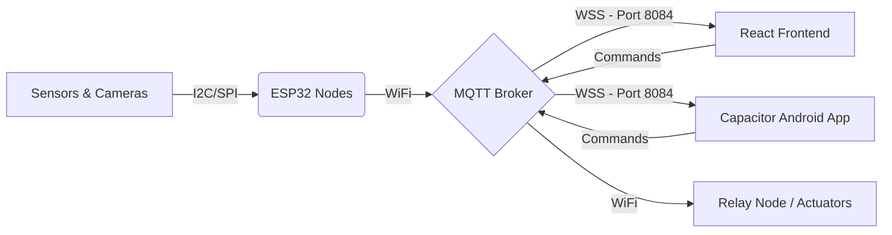

# System Architecture

The **AgriSense** platform operates on a decentralized IoT architecture, bridging the gap between field sensors and user applications via a fast, reliable MQTT protocol.

## High-Level Flow

## Hardware Nodes
The system is divided into modular ESP32 nodes to ensure scalability and fault tolerance:
1. **SoilNode**: Manages NPK, pH, moisture, and temperature diagnostics.
2. **WeatherNode**: Tracks ambient temp, humidity, LDR, and rainfall patterns.
3. **StorageNode**: Monitors silos for grain health, MQ135 gas levels, and AQI.
4. **WaterNode**: Manages irrigation flow, tank levels, and actuator control.
5. **SolarNode**: Monitors panel voltage, battery charge, and system energy load.

## Software Stack Layers
1. **Hardware Layer**: C++ (PlatformIO/Arduino IDE) on ESP32-S3/C3 modules.
2. **Messaging Layer**: Secure MQTT over WebSockets (WSS) via `mqttService.js`.
3. **Diagnostic Layer**: `deviceService.js` implementing weighted health scores and reactive heartbeats.
4. **Analytics Layer**: Recharts (Stabilized) providing 21+ forensic diagnostic charts.
5. **Client Layer**: React 19 + Vite frontend wrapped in Capacitor for native Android deployment.

