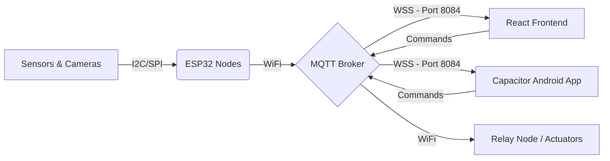

# System Architecture

The **AgriSense** platform operates on a decentralized IoT architecture, bridging the gap between field sensors and user applications via a fast, reliable MQTT protocol.

## High-Level Flow

## Hardware Nodes
The system is divided into modular ESP32 nodes to ensure scalability and fault tolerance:
1. **SoilNode**: Manages NPK, moisture, and temperature.
2. **CameraNode**: Handles ESP32-CAM live feeds for animal detection.
3. **RelayNode**: Controls irrigation pumps and solar relays.
4. **StorageNode**: Monitors silos/warehouses for grain health.

## Software Stack Layers
1. **Hardware Layer**: C++ (PlatformIO/Arduino IDE) on ESP32.
2. **Messaging Layer**: Secure MQTT over WebSockets (WSS).
3. **Client Layer**: React 19 + Vite frontend wrapped in Ionic Capacitor for native Android deployment.
4. **Analytics Layer**: Recharts and Framer Motion for rich data visualization.
